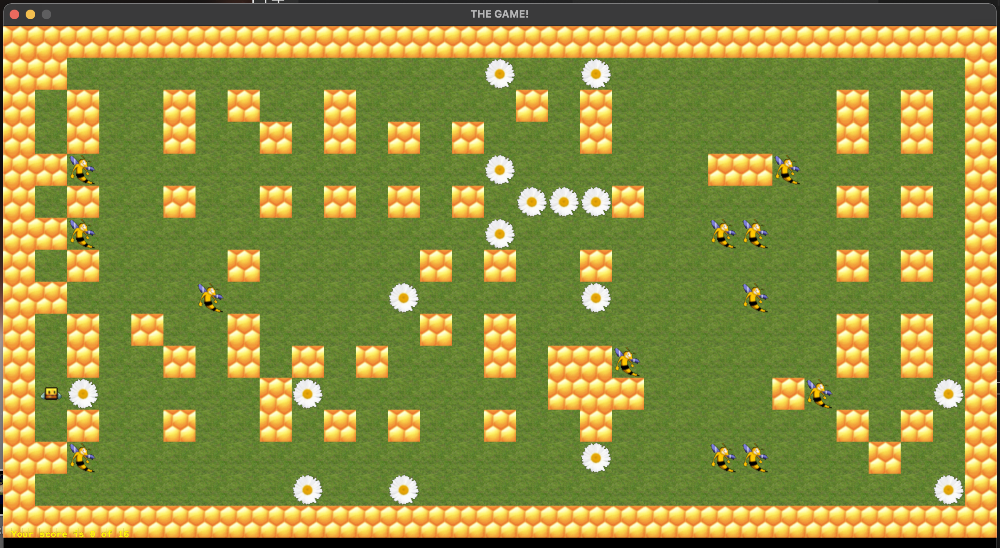

# So_Long
<h1 align="center">
</h1>
<h3 align="center"></h3>
<h4>
2Д игра на С с использованием MiniLibX

Используется библиотека 
minilibx_opengl.tgz для MaacOS

Для сборки использовать команду 
make

Запуск игры 
./so_long map.ber 
</h4>
